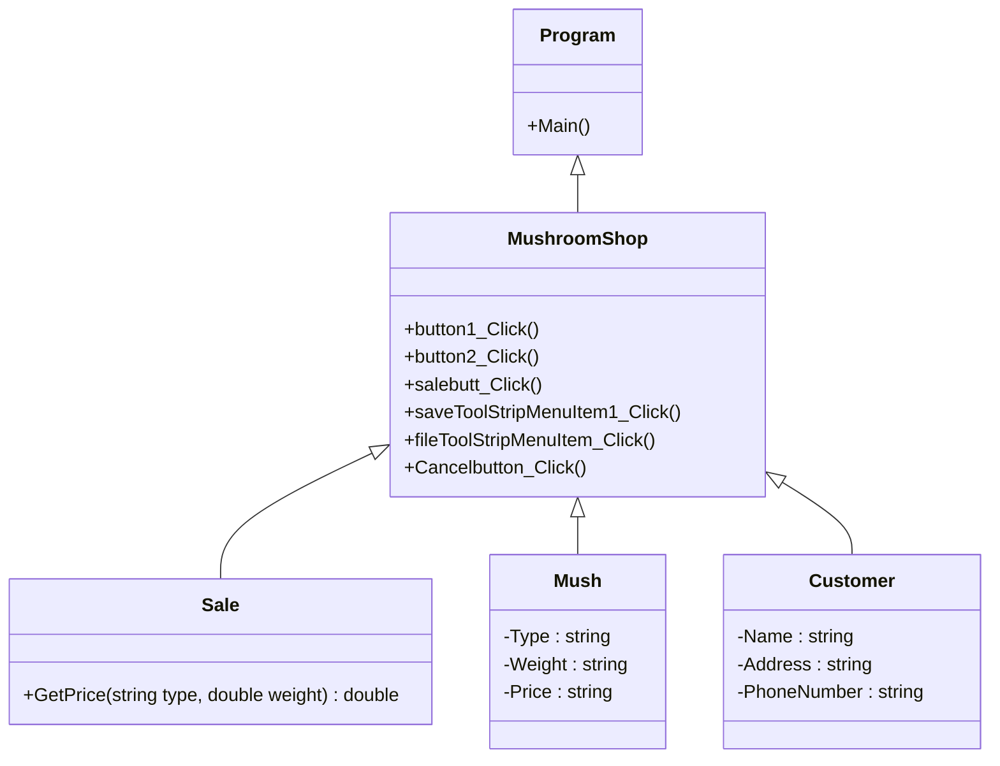

# MushroomPop
### ความเป็นมาของโปรแกรม
โปรแกรมนี้ คือ โปรแกรมการซื้อขาย "เห็ด" มาจากการที่ ที่บ้านผมมีธุระกิจฟาร์มเพาะเห็ด แต่ยังไม่มีการบันทึกการซื้อขายเห็ดที่เป็นดิจิตอล 

  
### วัตถุประสงค์ของโปรแกรม
เพื่อให้คนที่บ้านสามารถใช้โปรแกรมซื้อขายเห็ด ซึ่งสะดวกกว่าการจดบันทึกบนสมุด

  
### โครงสร้างของโปรแกรม (Class diagram)

  
### ชื่อของผู้พัฒนาโปรแกรม
663450353-1 นายเทพทินกร พรมโสภา
